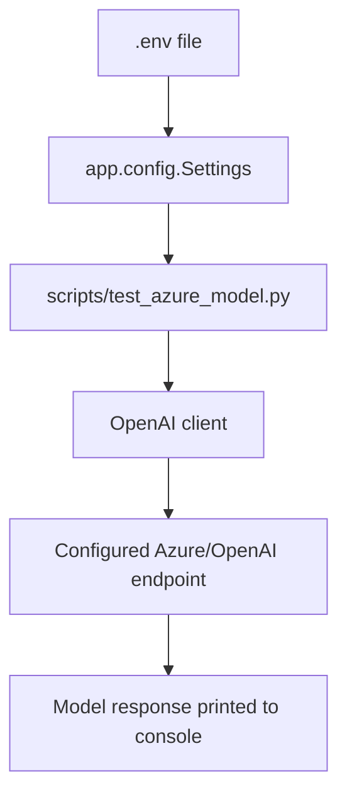

# ZenTech AI System Documentation

## 1. Project Overview

ZenTech-AI is a Python backend project prepared for an AI agent system. The project currently includes:

- A FastAPI application entry point.
- Runtime configuration loaded from environment variables and `.env`.
- A small script for testing the configured Azure/OpenAI-compatible model.
- Dependencies for FastAPI, OpenAI SDK, LangChain, and LangGraph.

At the current code state, LangChain and LangGraph are installed as dependencies but no agent graph, chain, node, tool, or state schema has been implemented yet.

## 2. Technology Stack

| Area | Technology |
| --- | --- |
| Language | Python 3.12+ |
| Web framework | FastAPI |
| ASGI server | Uvicorn |
| LLM SDK | OpenAI Python SDK |
| Configuration | Pydantic Settings |
| Agent libraries | LangChain, LangGraph |
| Package manager | uv-compatible project metadata |

## 3. Project Structure

```text
ZenTech-AI/
+-- app/
|   +-- __init__.py
|   +-- config.py
+-- scripts/
|   +-- test_azure_model.py
+-- docs/
|   +-- AI_SYSTEM_DOCUMENTATION.md
+-- main.py
+-- pyproject.toml
+-- test_main.http
+-- uv.lock
+-- .env
+-- .gitignore
```

## 4. Main Components

### 4.1 FastAPI Application

File: `main.py`

The FastAPI app exposes two simple endpoints:

| Method | Path | Purpose |
| --- | --- | --- |
| GET | `/` | Returns a basic health/demo response. |
| GET | `/hello/{name}` | Returns a greeting message for the provided name. |

Current behavior:

```json
{
  "message": "Hello World"
}
```

and:

```json
{
  "message": "Hello User"
}
```

These endpoints are currently sample endpoints only. They do not call the AI model or any LangChain/LangGraph workflow.

### 4.2 Runtime Configuration

File: `app/config.py`

Configuration is handled by a `Settings` class that extends `pydantic_settings.BaseSettings`.

Required environment variables:

| Variable | Purpose |
| --- | --- |
| `AZURE_OPENAI_API_KEY` | API key used to authenticate model requests. |
| `AZURE_OPENAI_ENDPOINT` | Base URL for the Azure/OpenAI-compatible endpoint. |
| `AZURE_OPENAI_MODEL_NAME` | Model or deployment name used when sending requests. |

Important implementation details:

- `.env` is loaded from the project root.
- Unknown extra environment variables are ignored.
- `get_settings()` is cached with `lru_cache`, so settings are loaded once per process.
- `settings = get_settings()` exposes a shared settings instance for imports.

### 4.3 Model Test Script

File: `scripts/test_azure_model.py`

This script verifies whether the configured model endpoint works.

Flow:

1. Adds the project root to `sys.path`.
2. Imports `settings` from `app.config`.
3. Builds an `OpenAI` client with:
   - `api_key=settings.azure_openai_api_key`
   - `base_url=settings.azure_openai_endpoint`
4. Sends a test request using `client.responses.create(...)`.
5. Prints `response.output_text`.

Current test input:

```text
hi
```

This script is useful for checking API key, endpoint, and model name configuration before wiring the model into the backend API.

## 5. Configuration and Secrets

The project expects secrets to be stored in `.env`.

Example format:

```env
AZURE_OPENAI_API_KEY=your_api_key_here
AZURE_OPENAI_ENDPOINT=your_endpoint_here
AZURE_OPENAI_MODEL_NAME=your_model_or_deployment_name_here
```

Security notes:

- `.env` is listed in `.gitignore`, so it should not be committed.
- Do not print or log full API keys.
- If configuration fails, prefer showing which variable is missing instead of exposing values.

## 6. How to Run

### 6.1 Install Dependencies

If using `uv`:

```bash
uv sync
```

If using `pip`:

```bash
pip install -e .
```

### 6.2 Start the FastAPI Server

```bash
uvicorn main:app --reload
```

Default local URL:

```text
http://127.0.0.1:8000
```

### 6.3 Test API Endpoints

Open:

```text
GET http://127.0.0.1:8000/
GET http://127.0.0.1:8000/hello/User
```

The same requests are documented in `test_main.http`.

### 6.4 Test Model Connectivity

```bash
python scripts/test_azure_model.py
```

Expected result:

- The script prints a response from the configured model.
- If it fails, check `.env`, endpoint format, model name, and API key.

## 7. Current AI Flow

The current AI flow is limited to the standalone model test script.



The FastAPI app does not currently call this flow.

## 8. Suggested Next Architecture

To turn this project into a real AI agent backend, a clean next step would be:

```text
API route
-> request schema
-> agent service
-> LangGraph state
-> graph nodes
-> model/tool execution
-> structured response
```

Suggested files:

```text
app/
+-- api/
|   +-- chat.py
+-- agents/
|   +-- state.py
|   +-- graph.py
|   +-- nodes.py
+-- services/
|   +-- llm_client.py
+-- schemas/
    +-- chat.py
```

Suggested responsibilities:

| File | Responsibility |
| --- | --- |
| `app/schemas/chat.py` | Pydantic request/response models. |
| `app/services/llm_client.py` | Build and reuse the model client. |
| `app/agents/state.py` | Define LangGraph state fields explicitly. |
| `app/agents/nodes.py` | Implement focused graph nodes. |
| `app/agents/graph.py` | Build and compile the LangGraph workflow. |
| `app/api/chat.py` | Expose the agent through FastAPI. |

Example state shape:

```python
class AgentState(TypedDict):
    user_request: str
    intent: str | None
    plan: list[str]
    tool_results: list[dict]
    final_answer: str | None
    error: str | None
```

## 9. Current Limitations

- No implemented LangChain chain yet.
- No implemented LangGraph graph yet.
- No AI API endpoint in FastAPI yet.
- No request/response schemas for chat or agent calls yet.
- No tests are currently defined in the project metadata.
- The model test script depends on valid `.env` values.

## 10. Recommended Immediate Improvements

1. Add a reusable LLM client module instead of creating the client directly in scripts.
2. Add a `/chat` or `/agent/invoke` FastAPI endpoint.
3. Define Pydantic schemas for request and response bodies.
4. Add a minimal LangGraph workflow with clear state.
5. Add targeted tests for configuration loading and API route behavior.
6. Keep model credentials isolated in `.env`.

## 11. Summary

The project is currently a starter AI backend. It already has the right base dependencies for FastAPI, OpenAI SDK, LangChain, and LangGraph, but the actual agent logic has not been implemented yet. The only model interaction today is through `scripts/test_azure_model.py`, while `main.py` exposes simple demo API routes.
